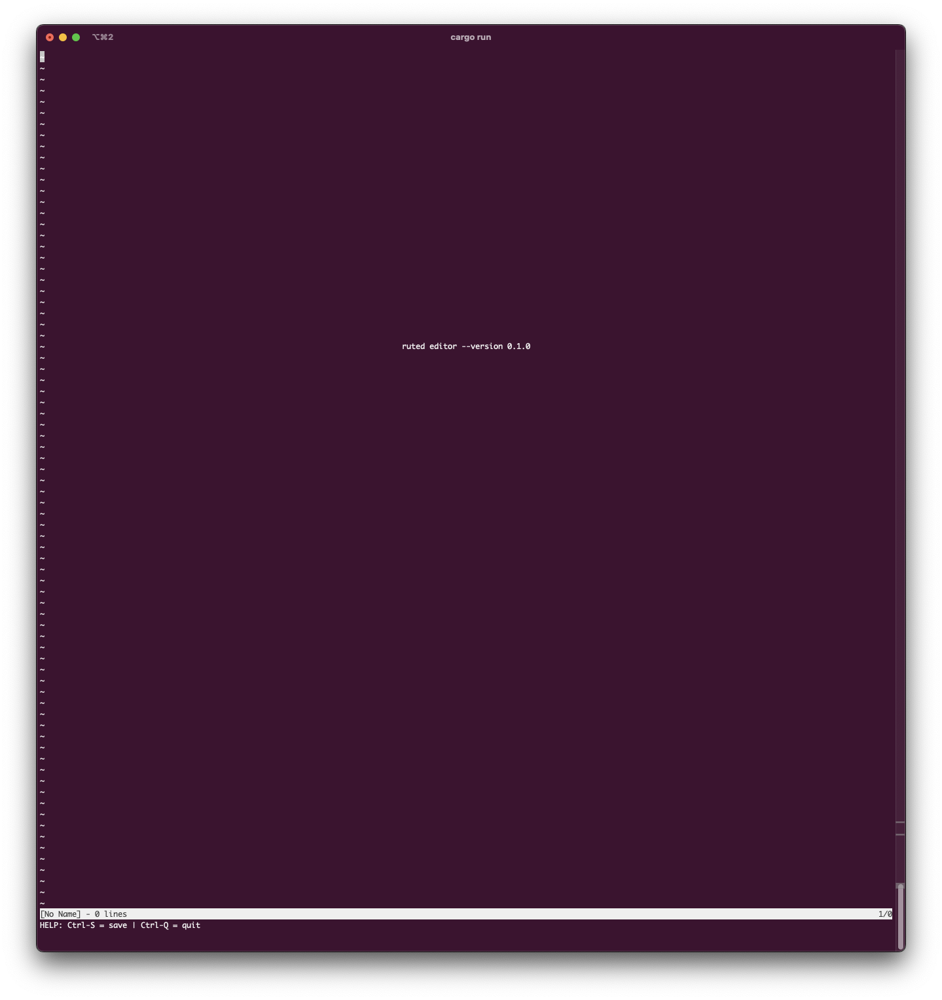

# ruText-Editor

This is a text editor in Rust.  

This is my first project to learn Rust。

## About The Project



## Getting Started
```
### First you need install Rust

git clone https://github.com/chongliujia/ruText-Editor.git)

cd ruText-Editor

cargo build

```

## License
Distributed under the MIT License.

## Contact
Chongliu Jia - chongliujia@gmail.com  

Project Link: [ruText-Editor](https://github.com/chongliujia/ruText-Editor)

## Acknowledgments
[Hecto: Build your own text editor in Rust](https://www.flenker.blog/hecto/)
